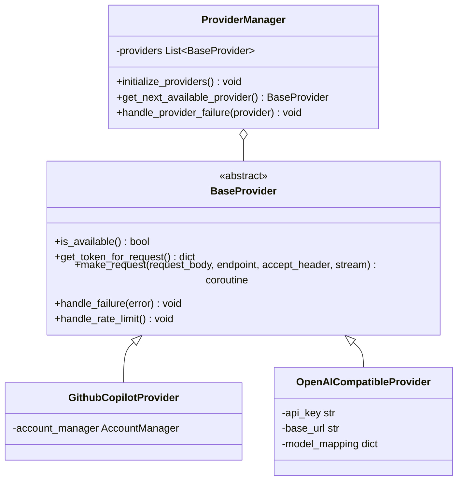

# Provider Abstraction Implementation Plan

This plan outlines how to add a provider abstraction layer that allows GitHub Copilot to be one of multiple providers while preserving its current implementation.

## 1. Overall Architecture



## 2. Implementation Plan

### 2.1 Create Provider Directory Structure
- Create `copilot_more/providers/` directory
- Create provider module files:
  - `base_provider.py`: Abstract provider interface
  - `github_copilot_provider.py`: GitHub Copilot implementation
  - `openai_compatible_provider.py`: OpenAI-compatible implementation
  - `provider_manager.py`: Provider management and selection
  - `__init__.py`: Module exports

### 2.2 Update Configuration Schema
Update `config.json` to support multiple providers:

```json
{
  "providers": [
    {
      "type": "github-copilot",
      "enabled": true,
      "priority": 1,
      "accounts": [
        {
          "id": "username@example.com",
          "token": "gho_xxxxxxxxxxxx",
          "proxy": { /* proxy settings */ }
        }
      ],
      "rate_limits": [ /* rate limits */ ]
    },
    {
      "type": "openai-compatible",
      "enabled": true,
      "priority": 2,
      "base_url": "https://api.your-openai-compatible-service.com/v1",
      "api_key": "your_api_key_here",
      "model_mapping": {
        "gpt-4": "your-equivalent-model"
      },
      "rate_limits": [ /* rate limits */ ]
    }
  ],
  "token_refresh_interval": 1000,
  "request_timeout": 100,
  "record_traffic": true
}
```

### 2.3 Update Config Loader
Modify `config.py` to parse the new provider configuration format and expose it via a global variable.

### 2.4 Implement BaseProvider Interface
```python
# copilot_more/providers/base_provider.py
from abc import ABC, abstractmethod
from typing import Dict, Optional, Any, AsyncGenerator, Union

class BaseProvider(ABC):
    """Base class for all providers."""
    
    @abstractmethod
    async def is_available(self) -> bool:
        """Check if the provider is available and can handle requests."""
        pass
    
    @abstractmethod
    async def get_token_for_request(self) -> Dict[str, str]:
        """Get authentication token for request."""
        pass
    
    @abstractmethod
    async def make_request(self, 
                          request_body: Dict[str, Any], 
                          endpoint: str, 
                          accept_header: str = "application/json", 
                          stream: bool = False) -> Optional[Union[AsyncGenerator, Dict[str, Any]]]:
        """Make a request to the provider's API endpoint."""
        pass
    
    @abstractmethod
    def handle_failure(self, error: Exception) -> None:
        """Handle failure in request."""
        pass
    
    @abstractmethod
    def handle_rate_limit(self) -> None:
        """Handle rate limit response from provider."""
        pass
```

### 2.5 Implement Provider Manager
```python
# copilot_more/providers/provider_manager.py
class ProviderManager:
    """Manages multiple AI providers."""
    
    def __init__(self):
        self.providers = []
        self.priority_order = []
        
    def initialize_providers(self, provider_configs):
        # Initialize providers based on configuration
        pass
        
    async def get_next_available_provider(self):
        # Get next available provider in priority order
        pass
        
    def handle_provider_failure(self, provider):
        # Handle provider failure by moving to next provider
        pass
```

### 2.6 Refactor Server Implementation
Update `server.py` to use the provider abstraction:

1. Remove direct GitHub Copilot API interactions
2. Initialize the provider manager
3. Update request handlers to use available providers in priority order
4. Handle seamless provider failover

## 3. Implementation Steps

1. Create provider directory structure
2. Implement base provider interface
3. Extract GitHub Copilot functionality into provider implementation
4. Implement OpenAI-compatible provider
5. Create provider manager
6. Update configuration and loading
7. Refactor server to use provider abstraction
8. Add tests for provider abstraction

## 4. Benefits

- **Modularity**: Clear separation between provider-specific logic and application flow
- **Extensibility**: Adding new providers becomes straightforward
- **Resilience**: Transparent failover between providers when one fails
- **Flexibility**: Configure provider priority based on cost, reliability, or other factors

## 5. Adding a New Provider

The system is designed to make adding new providers straightforward. Here's how to add a new OpenAI-compatible provider:

### 5.1 Configuration

Add a new provider entry to the `providers` array in `config.json`:

```json
{
  "providers": [
    {
      "type": "github-copilot",
      "enabled": true,
      "priority": 1,
      "accounts": [ ... ],
      "rate_limits": [ ... ]
    },
    {
      "type": "openai-compatible",
      "enabled": true,
      "priority": 2,
      "base_url": "https://api.your-openai-compatible-service.com/v1",
      "api_key": "your_api_key_here",
      "model_mapping": {
        "gpt-4": "your-equivalent-model",
        "gpt-3.5-turbo": "your-other-model"
      },
      "rate_limits": [ ... ]
    }
  ]
}
```

### 5.2 Priority Order

Providers will be tried in order of their `priority` value (lower numbers have higher priority). For example:

- Priority 1: GitHub Copilot (tried first)
- Priority 2: OpenAI-compatible service (tried if GitHub Copilot fails)
- Priority 3: Another provider (tried if both of the above fail)

### 5.3 Model Mapping

The `model_mapping` field allows mapping model names sent by clients to model names supported by the provider. For example, if a client requests "gpt-4" but your provider uses a different name like "premium-model", you can map them:

```json
"model_mapping": {
  "gpt-4": "premium-model",
  "gpt-3.5-turbo": "standard-model"
}
```

### 5.4 Failover Behavior

When a provider fails (e.g., rate limited, authentication error, etc.), the system automatically tries the next provider in priority order. This happens transparently to the client.